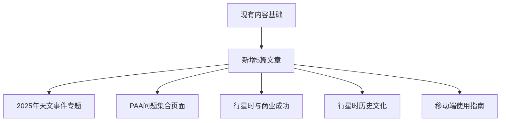

# Design Document - Planetary Hours Calculator 内容策略

## Overview

基于深度市场研究和PAA分析，我们将创建5篇高质量的SEO优化文章，专注于填补现有内容的空白，利用2025年天文事件热点和用户搜索需求。

### 现有内容分析
项目已有4篇文章：
1. introduction.md - 计算器介绍和功能
2. what-are-planetary-hours.md - 基础概念解释
3. using-planetary-hours.md - 实用应用指南
4. algorithm-behind-calculator.md - 技术算法详解

### 内容策略目标
- 填补现有内容空白
- 针对高搜索量PAA问题创建内容
- 利用2025年天文事件热点
- 提升整体SEO表现

## Architecture

### 新内容架构



## Components and Interfaces

### 新增文章详细设计

#### 文章1: "2025年天文奇观：行星排列如何影响你的Planetary Hours"
**目标关键词**: "2025 planetary alignment", "planetary hours 2025", "astronomical events 2025"
**内容重点**:
- 2025年1月行星大游行的特殊意义
- 行星排列期间planetary hours的能量变化
- 如何利用这些特殊时期优化个人计划
- 与现有计算器的结合使用

#### 文章2: "Planetary Hours常见问题解答：专家回答你最关心的问题"
**目标关键词**: "planetary hours FAQ", "do planetary hours work", "planetary hours questions"
**内容重点**:
- 基于PAA研究的20个高频问题
- 结构化答案格式，优化featured snippets
- 每个问题包含实用示例和工具链接
- 避免与现有文章重复

#### 文章3: "商业成功的秘密武器：如何用Planetary Hours提升工作效率"
**目标关键词**: "planetary hours business", "productivity astrology", "timing business decisions"
**内容重点**:
- 商业决策的最佳planetary hours
- 会议、谈判、签约的时机选择
- 成功案例和实用策略
- 现代企业家的时间管理智慧

#### 文章4: "从古巴比伦到现代：Planetary Hours的历史文化之旅"
**目标关键词**: "planetary hours history", "ancient astrology", "Chaldean order origin"
**内容重点**:
- Planetary hours的历史起源
- 不同文化中的时间观念
- 古代智慧在现代的应用
- 文化背景对理解系统的重要性

#### 文章5: "移动时代的Planetary Hours：随时随地掌握宇宙节奏"
**目标关键词**: "planetary hours app", "mobile astrology", "planetary hours on phone"
**内容重点**:
- 移动端使用技巧和最佳实践
- PWA功能介绍和安装指南
- 离线使用和通知设置
- 移动端独有的便利功能

## Data Models

### 文章内容结构

每篇文章将遵循以下markdown结构：

```markdown
---
title: "[SEO优化标题]"
excerpt: "[150字以内的摘要，包含主要关键词]"
date: "[发布日期]"
author: "Planetary Hours Team"
keywords: ["主关键词", "次要关键词1", "次要关键词2"]
---

# [H1标题 - 包含主关键词]

[引言段落 - 包含关键词和用户痛点]

## [H2副标题1]
[内容段落]

## [H2副标题2]
[内容段落]

### [H3子标题]
[详细内容]

## 结论
[总结和CTA]
```

### SEO优化要素

- **标题长度**: 50-60字符
- **描述长度**: 150-160字符  
- **关键词密度**: 主关键词1-2%，相关关键词0.5-1%
- **内链**: 每篇文章至少3个内链到现有内容
- **外链**: 权威来源引用
- **图片**: 每篇文章至少1张优化图片

## Error Handling

### 内容质量控制

1. **避免内容重复**
   - 与现有4篇文章内容对比检查
   - 确保新角度和独特价值
   - 交叉引用而非重复信息

2. **SEO技术检查**
   - 标题标签长度: 50-60字符
   - 描述标签长度: 150-160字符
   - 关键词自然融入，避免堆砌
   - 内链到现有相关文章

3. **内容一致性**
   - 术语使用与现有文章保持一致
   - 品牌语调统一
   - 技术信息准确性验证

## Testing Strategy

### 内容发布策略

#### 发布时间安排
- **第1周**: 2025年天文事件文章（利用1月行星排列热点）
- **第2周**: PAA问题解答文章（填补搜索需求空白）
- **第3周**: 商业应用文章（针对专业用户群体）
- **第4周**: 历史文化文章（提供深度背景知识）
- **第5周**: 移动端指南（优化用户体验）

#### 内容优化指标

1. **SEO表现**
   - 目标关键词排名提升
   - Featured snippets获得数量
   - 有机搜索流量增长

2. **用户参与**
   - 平均停留时间 > 3分钟
   - 跳出率 < 60%
   - 内链点击率 > 15%

3. **内容质量**
   - 社交分享数量
   - 外部引用和链接
   - 用户反馈和评论

### 成功衡量标准

#### 短期目标（1个月内）
- 5篇新文章全部发布
- 至少3个新关键词进入前20名
- 整体网站流量增长20%

#### 中期目标（3个月内）
- 获得至少5个featured snippets
- 新文章平均停留时间超过现有文章
- 移动端流量占比提升至60%

#### 长期目标（6个月内）
- 成为planetary hours领域的权威内容源
- 建立稳定的有机搜索流量增长
- 用户回访率和品牌认知度显著提升