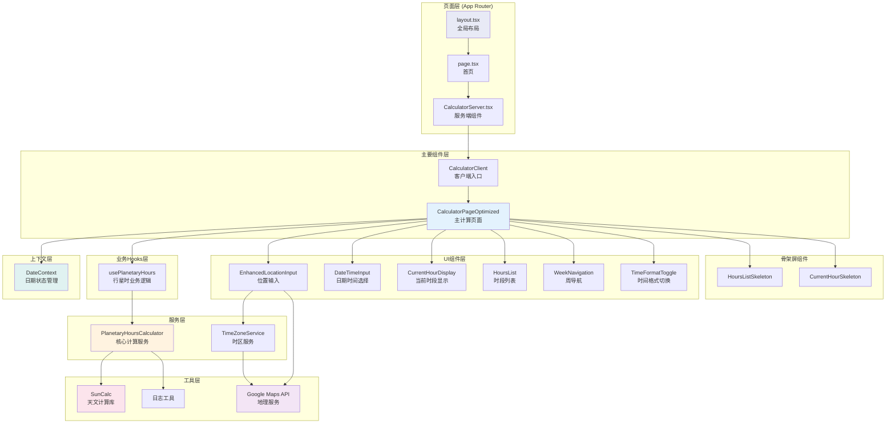

# 组件架构图 (Component Architecture Diagram)

## 概述
本文档展示了行星时计算器应用的组件层次结构和依赖关系，涵盖了从页面层到工具层的完整架构。

## 组件架构图

## 架构层次分析

### 1. 页面层 (App Router)
- **layout.tsx**：全局布局，包含头部、元数据和全局样式
- **page.tsx**：首页入口，处理SEO和初始数据获取
- **CalculatorServer.tsx**：服务端组件，负责预计算数据的SSR

### 2. 主要组件层
- **CalculatorPageOptimized**：主计算页面，集成所有功能
- **CalculatorClient**：客户端入口，连接服务端和客户端逻辑

### 3. 状态管理层
- **DateContext**：React Context，管理全局日期状态
- **usePlanetaryHours**：自定义Hook，封装行星时计算逻辑

### 4. UI组件层
- **EnhancedLocationInput**：智能位置输入，支持搜索和自动完成
- **DateTimeInput**：日期时间选择器，支持多种格式
- **CurrentHourDisplay**：当前行星时显示，突出显示当前时段
- **HoursList**：24小时行星时列表，支持日间/夜间切换
- **WeekNavigation**：周导航，便于日期切换
- **TimeFormatToggle**：12/24小时格式切换

### 5. 性能优化组件
- **HoursListSkeleton**：时段列表骨架屏
- **CurrentHourSkeleton**：当前时段骨架屏
- **懒加载**：非关键组件采用React.lazy()

### 6. 服务层
- **PlanetaryHoursCalculator**：核心计算引擎
  - 单例模式，避免重复实例化
  - 内置缓存机制，提升性能
  - 支持多时区和任意日期计算
- **TimeZoneService**：时区服务，集成Google Maps时区API

### 7. 工具层
- **SunCalc**：第三方天文计算库，计算日出日落时间
- **Google Maps API**：地理编码和时区查询
- **Logger**：统一日志工具，支持不同级别的日志输出

## 设计模式

### 1. 单例模式
- **PlanetaryHoursCalculator**：确保全局唯一实例，共享缓存

### 2. 工厂模式
- **Logger**：createLogger工厂函数，创建带标签的日志实例

### 3. 观察者模式
- **React Context**：状态变更时自动通知所有订阅组件

### 4. 策略模式
- **缓存策略**：内存缓存 → 文件缓存 → 实时计算

### 5. 代理模式
- **Service Worker**：作为网络请求代理，实现离线缓存

## 性能优化策略

### 1. 代码分割
- 路由级分割：不同页面按需加载
- 组件级分割：非关键组件懒加载
- 第三方库分割：vendor bundle独立打包

### 2. 渲染优化
- **SSR**：服务端预渲染，提升首屏速度
- **ISR**：增量静态再生，平衡性能和数据新鲜度
- **Client-side缓存**：避免重复计算和网络请求

### 3. bundle优化
- **Tree shaking**：移除未使用代码
- **代码压缩**：生产环境自动压缩
- **图片优化**：Next.js Image组件自动优化

### 4. 内存管理
- **缓存清理**：定期清理过期缓存
- **事件监听器清理**：组件卸载时清理
- **防抖节流**：用户输入防抖，API调用节流

创建日期: ${new Date().toLocaleDateString('zh-CN')}
