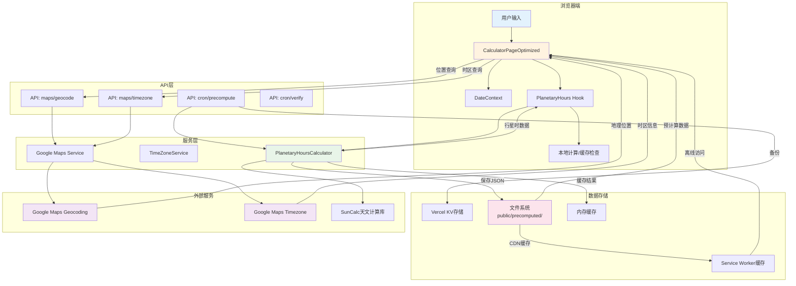

# 数据流转图 (Data Flow Diagram)

## 概述
本文档展示了行星时计算器应用中数据在各个层级和组件间的流转关系，包括API调用、缓存策略和服务依赖。

## 数据流转图

## 数据流分析

### 1. 前端数据流
- **用户输入** → **CalculatorPageOptimized**：处理位置、日期等用户输入
- **DateContext**：全局日期状态管理，避免props drilling
- **PlanetaryHours Hook**：封装行星时计算的业务逻辑

### 2. API层交互
- **maps/geocode**：将地址转换为经纬度坐标
- **maps/timezone**：根据坐标获取时区信息
- **cron/precompute**：定时预计算纽约数据
- **cron/verify**：验证预计算文件完整性

### 3. 服务层处理
- **PlanetaryHoursCalculator**：核心计算引擎，处理天文算法
- **TimeZoneService**：时区相关服务
- **Google Maps Service**：地理服务的统一接口

### 4. 多级缓存策略
- **内存缓存**：计算结果的临时存储
- **文件系统缓存**：预计算JSON文件
- **Vercel KV**：分布式键值存储
- **Service Worker缓存**：离线访问支持

### 5. 外部依赖
- **Google Maps API**：提供地理编码和时区服务
- **SunCalc库**：精确的天文计算（日出日落时间）

## 性能优化策略

### 缓存层级
1. **L1 缓存**：内存中的计算结果（最快）
2. **L2 缓存**：预计算的JSON文件（较快）
3. **L3 缓存**：Vercel KV存储（容错）
4. **L4 缓存**：Service Worker离线缓存（离线可用）

### 数据预计算
- 每日22:00自动生成纽约次日数据
- 减少首屏计算时间，提升用户体验
- 23:00验证机制确保数据完整性

### API频率控制
- 地理编码和时区查询有频率限制
- 缓存机制减少重复API调用
- 默认城市跳过API调用以节省配额

创建日期: ${new Date().toLocaleDateString('zh-CN')}
