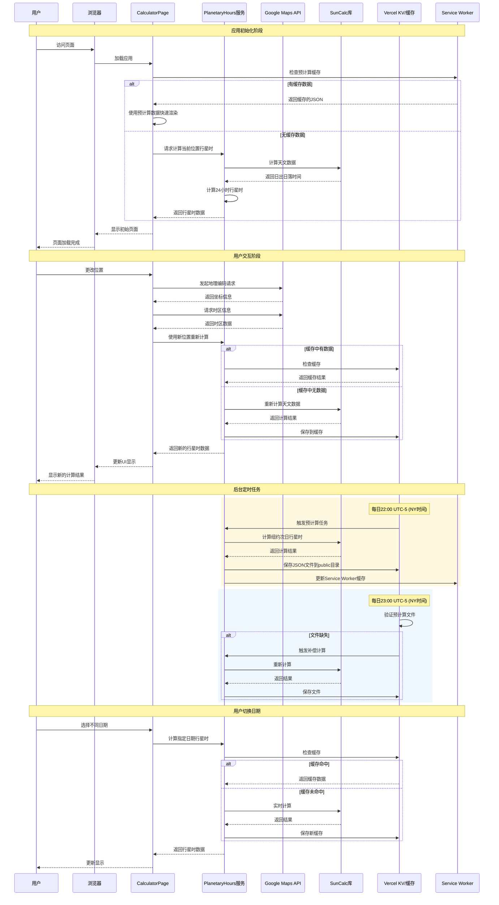

# 时序图 (Sequence Diagram)

## 概述
本文档展示了行星时计算器应用中关键操作的时间序列，包括应用初始化、用户交互和后台定时任务的完整时序流程。

## 应用交互时序图

## 关键时序分析

### 1. 应用初始化流程 (0-2秒)
- **首屏加载优化**：优先检查预计算缓存
- **渐进式渲染**：有缓存时立即显示，无缓存时实时计算
- **零闪烁体验**：预计算数据避免CLS（累积布局偏移）

### 2. 用户交互响应 (100-500毫秒)
- **位置更改**：地理编码 → 时区查询 → 重新计算
- **缓存优先策略**：先检查缓存，缓存未命中时才实时计算
- **UI即时反馈**：加载状态确保用户感知操作进度

### 3. 后台定时任务 (每日执行)
- **22:00预计算**：生成纽约次日数据，更新缓存
- **23:00验证任务**：检查文件完整性，缺失时补偿计算
- **00:01重新验证**：触发ISR revalidate确保数据新鲜度

### 4. 缓存命中策略
- **内存缓存**：最快响应，适用于重复计算
- **文件缓存**：预计算JSON，适用于常见查询
- **分布式缓存**：Vercel KV，适用于全球用户

## 性能特征

### 响应时间目标
- **LCP (最大内容绘制)** < 1秒
- **FID (首次输入延迟)** < 100毫秒
- **CLS (累积布局偏移)** = 0
- **INP (交互到下次绘制)** < 200毫秒

### 容错机制
- **降级策略**：API失败时使用默认位置
- **重试机制**：网络错误时的指数退避重试
- **离线支持**：Service Worker缓存已访问数据
- **错误边界**：组件级错误隔离，避免全局崩溃

### 监控点
- **API调用频率**：避免超出Google Maps配额
- **缓存命中率**：监控各级缓存效果
- **计算耗时**：SunCalc库的性能表现
- **用户体验指标**：Core Web Vitals实时监控

创建日期: ${new Date().toLocaleDateString('zh-CN')}
