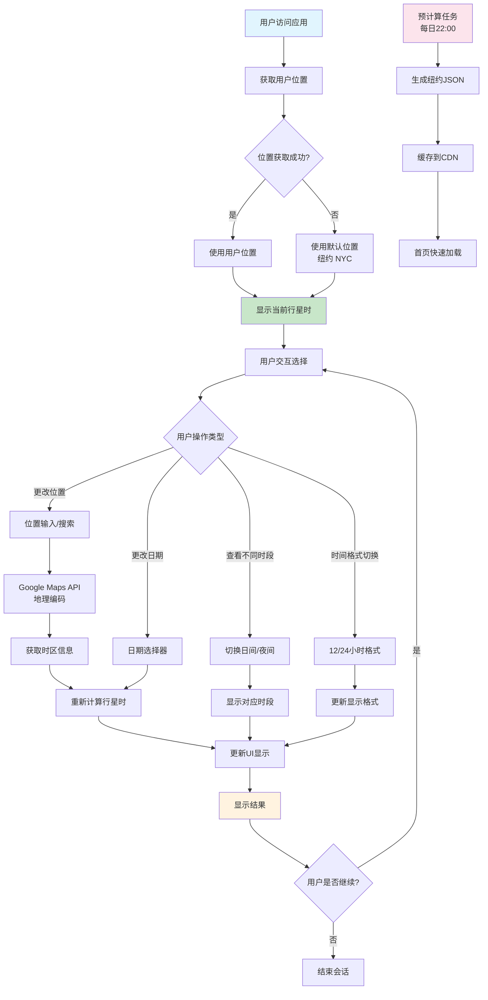

# 用户流程图 (User Flow Diagram)

## 概述
本文档展示了行星时计算器应用的用户交互流程，从用户首次访问到完成行星时查询的完整路径。

## 用户流程图

## 关键流程说明

### 1. 初始化阶段
- 用户访问应用时，首先尝试获取地理位置
- 如果位置获取失败，使用纽约作为默认位置
- 显示当前行星时信息

### 2. 用户交互阶段
- **位置更改**：通过Google Maps API进行地理编码和时区查询
- **日期选择**：支持任意日期的行星时查询
- **时段切换**：在日间和夜间行星时之间切换
- **格式切换**：支持12小时和24小时时间格式

### 3. 后台优化
- 每日22:00进行纽约数据预计算
- 预计算结果缓存到CDN，提升首页加载速度
- 支持离线访问已缓存的数据

### 4. 响应式反馈
- 所有操作都有即时的UI反馈
- 加载状态和错误处理确保良好的用户体验

## 性能特性
- **0 CLS**：预计算数据避免首屏闪烁
- **LCP < 1s**：服务端组件 + 缓存策略
- **离线可用**：Service Worker缓存机制
- **INP < 200ms**：优化的移动端交互响应

创建日期: ${new Date().toLocaleDateString('zh-CN')}
